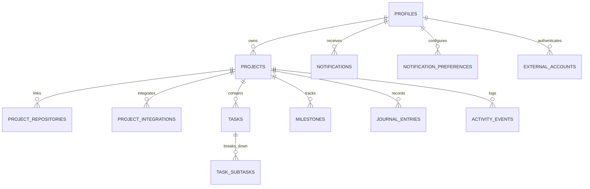

# App Wallet Architecture Documentation

## 1. High-Level Architecture
App Wallet is designed as a modern, multi-tenant Serverless Full-Stack application powered by:
- **Frontend**: React Native with Expo Router v4 (supporting Cross-Platform Web, iOS, Android).
- **Backend-as-a-Service**: Supabase Cloud PostgreSQL with Row Level Security (RLS) policies.
- **Serverless API Layer**: Deno Edge Functions for secret-isolated OAuth exchanges and webhooks.

---

## 2. Multi-Tenant Database Schema

The database consists of **13 relational tables** scoped by `user_id`:

### Table Definitions & Foreign Key Relationships
1. `profiles` (`id` references `auth.users(id)`).
2. `projects` (`user_id` references `profiles(id)`).
3. `project_repositories` (`project_id` references `projects(id)`).
4. `project_integrations` (`project_id` references `projects(id)`).
5. `tasks` (`project_id` references `projects(id)`).
6. `task_subtasks` (`task_id` references `tasks(id)`).
7. `milestones` (`project_id` references `projects(id)`).
8. `journal_entries` (`project_id` references `projects(id)`).
9. `activity_events` (`project_id` references `projects(id)`).
10. `notifications` (`user_id` references `profiles(id)`).
11. `notification_preferences` (`user_id` references `profiles(id)`).
12. `external_accounts` (`user_id` references `profiles(id)`).
13. `sync_state` (`user_id` references `profiles(id)`).

---

## 3. Security Isolation Model

### Secret-Isolated Edge Functions
To comply with strict security requirements:
- **No Secret Tokens in Client Bundles**: Client environment variables ONLY contain public keys (`EXPO_PUBLIC_SUPABASE_ANON_KEY`, `EXPO_PUBLIC_GITHUB_CLIENT_ID`).
- **Serverless Execution**: OAuth secrets (`GITHUB_CLIENT_SECRET`) and API tokens (`VERCEL_AUTH_TOKEN`) run strictly inside Deno Edge Functions:
  - `supabase/functions/github-oauth`
  - `supabase/functions/github-webhook`
  - `supabase/functions/vercel-sync`

---

## 4. Performance Indexes
The database is equipped with 13 multi-tenant indexes:
- `idx_projects_user_id`
- `idx_projects_status`
- `idx_projects_health`
- `idx_projects_last_activity`
- `idx_project_repositories_project_id`
- `idx_project_integrations_project_id`
- `idx_tasks_project_id`
- `idx_tasks_status`
- `idx_task_subtasks_task_id`
- `idx_milestones_project_id`
- `idx_journal_entries_project_id`
- `idx_activity_events_project_id`
- `idx_notifications_user_unread`
